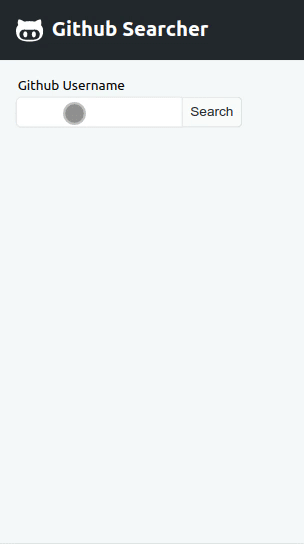
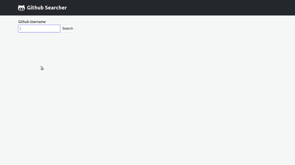

<p align="center">
  <h3 align="center">Github Searcher</h3>
  <p align="center">
    Just a small project to practice react skills
    <br />
    <a href="https://github-searcher-1904.netlify.app/">Live Demo</a>
    ·
    <a href="https://github.com/ribeirotomas1904/github-searcher/issues">Report Bug</a>
  </p>
</p>


<!-- TABLE OF CONTENTS -->
## Table of Contents

* [About the Project](#about-the-project)
  * [Demo](#demo)
  * [Built With](#built-with)
* [Getting Started](#getting-started)
  * [Prerequisites](#prerequisites)
  * [Installation](#installation)
* [Contact](#contact)


## About The Project

### Demo

#### Mobile



#### Browser



### Built With

* [axios](https://www.npmjs.com/package/axios)
* [redux](https://www.npmjs.com/package/redux)
* [styled-components](https://www.npmjs.com/package/styled-components)
* [react icons](https://www.npmjs.com/package/react-icons)
* [date-fns](https://www.npmjs.com/package/date-fns)

## Getting Started

To get a local copy up and running follow these simple steps.

### Prerequisites

- Node.js
- Yarn

### Installation

1. Clone the repo
```sh
git clone https://github.com/ribeirotomas1904/github-searcher.git
```

2. Install NPM packages
```sh
yarn install
```

3. Run the app in localhost
```sh
yarn start
```

## Contact

Email: ribeirotomas1904@gmail.com

LinkedIn: https://www.linkedin.com/in/nathanael-ribeiro/

